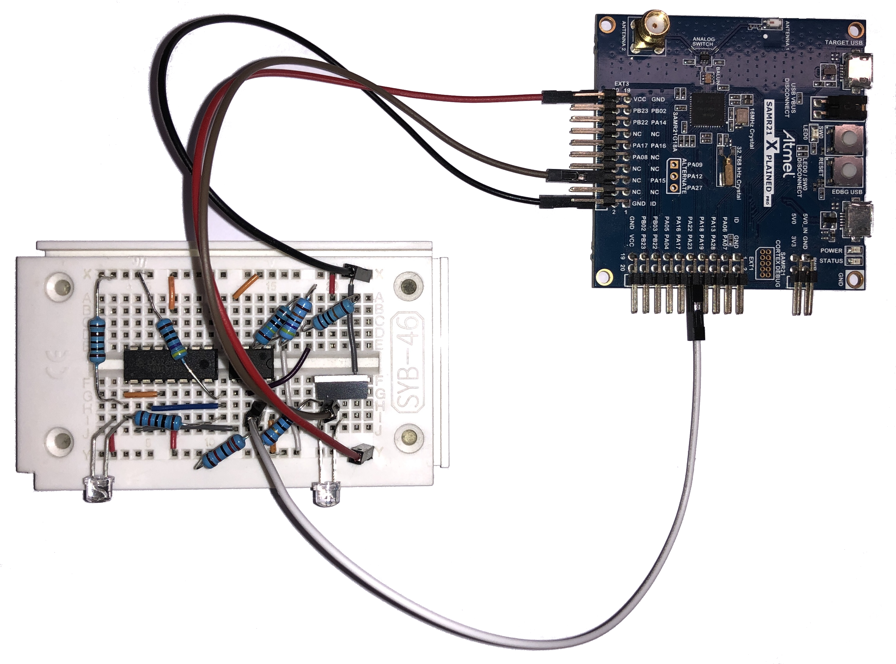
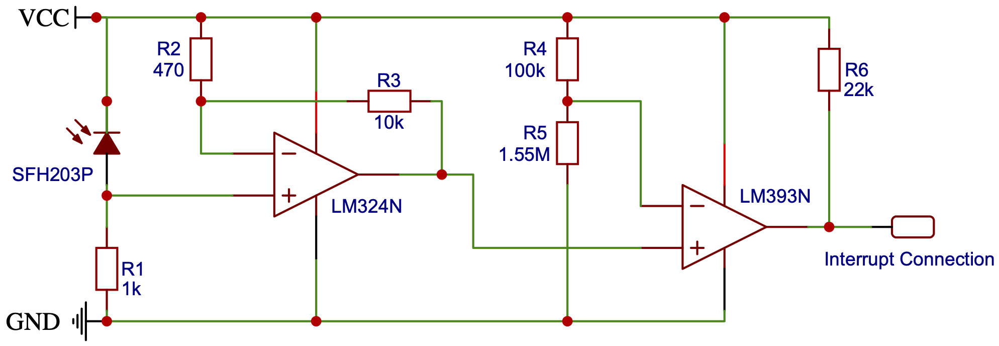

# Low-cost IP over Visible Light Communication System for the IoT 

This project was developed in the scope of a bachelor's thesis.
It provides a physical and link layer implemenation for a low-cost Visible LIght Communication (VLC) system uing the RIOT OS.
RIOT provides the upper network stack with e.g. IPv6 and UDP.
Here you can find the code as well as documentation on how to use this VLC implementation together with RIOT.
More details e.g. about the requiered hardware, limitatons and examples will follow soon.

## Hardware
Each VLC node consists of an Atmel SAM R21 Xplained Pro board with an ATSAMR21G18A microcontroller and a transceiver board.
The board is equipped with extension headers where external hardware, in this case the VLC sender and receiver, can be connected. The sender and the receiver components are build up on a prototyping board.

### Sender

The microcontroller is not able to modulate the LED directly because it cannot provide the sufficient current at the GPIO pins.
The LED used in the prototype emits blue light atLM393N a beam angle of 120 degrees.
To switch the LED on and off a MOSFET (L2203N) is used.
It behaves like a switch for the LED controlled by the microcontroller.
Finally, a resistor must be added to the LED (TRU COMPONENTS 1577392) to limit the current through the LED.

### Receiver

The receiver circuit is more complex compared to the sender circuit.
It needs to convert the incoming light into an electrical signal.
The receiver build in this work is based on the VLC receiver of Goswami et.al. [1].
Because not all parts are available in the exact same version and the Arduino provides 5V instead of 3.3V supplied by the Atmel SAM R21 Xplained Pro board, some adaptions need to be made.

First, the photodiode converts the incoming light into electrical current.
The photodiode SFH 203 P has a very short switching time of 5 ns. The electrical current at the photodiode is converted into voltage using a resistor. Therefore, Ohm’s Law U = R ∗ I also applies. Because of this, the voltage at the photodiode is proportional to the used resistor. The value of the resistor R1 is chosen 10 times higher than the resistor used in the receiver circuit of Goswami et.al. [1] because of a better sensibility together with the other receiver components used in this prototype.

Because the voltage at the resistor is in an order of a hundred millivolts, it needs to be amplified. Therefore an amplifier is used in the circuit.
The amplifier needs two resistors to adjust the amplification factor. The amplification factor G is calculated by the following formula [2]: G = 1 + (R3 / R2).
Goswami et.al. [1] were using an amplification factor of 2.745. To increase the sensitivity for higher communication distances, an amplification factor of 22.277 is used.
Higher amplification levels also increase the noise.
So, the level cannot be increased limitlessly.

The amplified signal is an analog signal and varies depending on the brightness of the incoming light. But the microcontroller needs a digital input. This is done by a comparator.
The comparator compares the incoming amplified signal with a reference voltage. If the input voltage is less than the reference voltage the comparator outputs 0 V. Else, if the input voltage is greater than or equal the reference voltage, the comparator outputs 3.3 V.
The reference voltage is provided by a voltage divider. The reference voltage is adjusted to the brightest light condition. This way, the sunlight or illumination do not trigger the receiver interrupt at the microcontroller. On the other hand, this has the disadvantage that signals at higher distances at lower lighting condition will not be detected anymore because the threshold is too high.

As an alternative to the voltage divider a variable resistor can be used at varying lighting conditions to control the reference voltage manually. In the paper of Goswami et.al. [1] also an automatic gain controller is proposed to adjust the reference voltage automatically depending on the light conditions. To keep the complexity and cost low, a simple voltage divider, adjusted to the brightest light conditions, is used in the prototype of this work. At the brightest lighting conditions and without the light from the sender approximately 0.175 V applies at the input of the operator. So, a reference voltage of 0.2 V is used so that the receiver only triggers if it receives light from the sender. To adjust the reference voltage of 0.2V at the voltage divider, the resistors can be calculated using the following formula [3]:
R5 = ((U_source / U_div) * R4) - R4 where U_source is the voltage provided by the development board, U_div the voltage taken from the voltage divider, R4 the first resistor and R5 the second one. The energy consumption will be higher if the resistors have a small value. Hence, R4 of the formula is chosen as 100 kΩ.
A second resistor R5 of 1.55 MΩ is necessary.
Because 1.55 MΩ is not a standard resistor value, two resistors of 1 MΩ and 470 kΩ are arranged in a row to add up to 1.47 MΩ which is close enough to 1.55 MΩ.
Finally, a pull-up resistor R6 is used at the output to get a clear output signal.

## References
[1] P. Goswami and M. Shukla. Design of a li-fi transceiver. Wireless Engineering and Technology, 8(4):71–86, 2017.

[2] Patrick Schnabel. Nichtinvertierender Verstärker. Elektronik Kompendium. https://www.elektronik-kompendium.de/sites/slt/0210151.htm, Accessed: 2021/03/06.

[3] Patrick Schnabel. Spannungsteiler / Spannungsteilerschaltung. Elektronik Kom- pendium. https://www.elektronik-kompendium.de/sites/slt/0201111.htm, Accessed: 2021/03/06.
